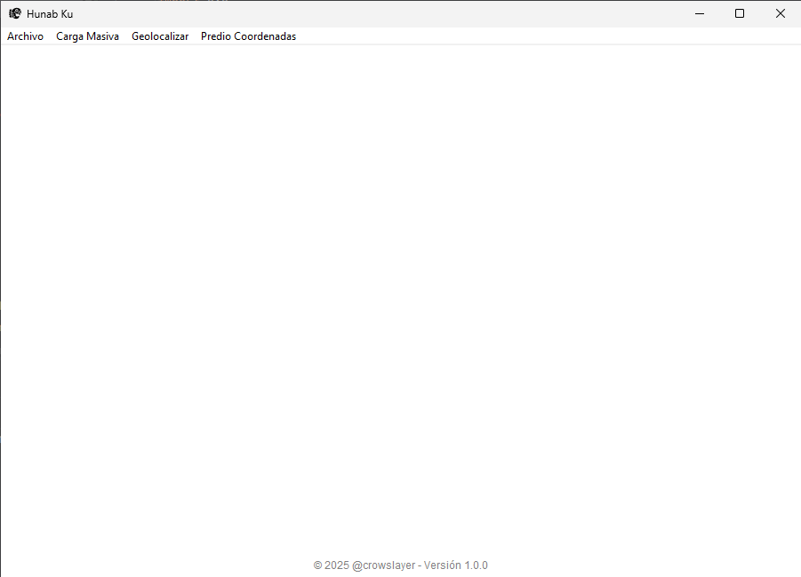
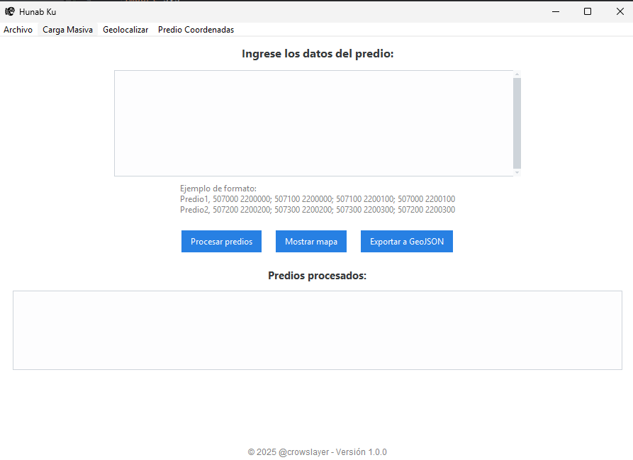
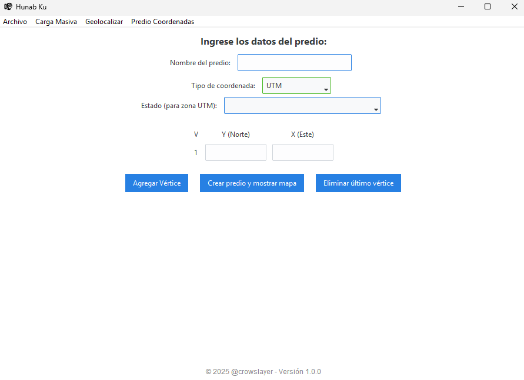
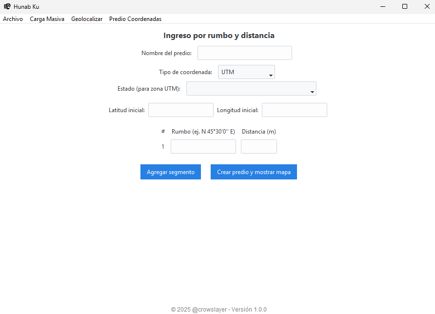
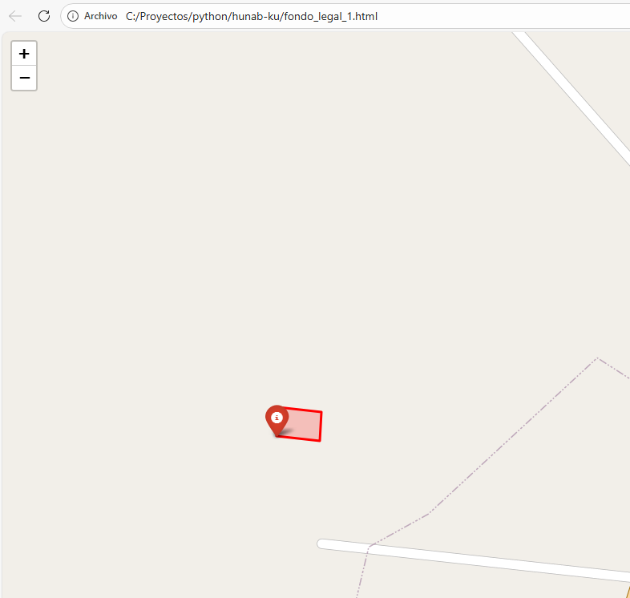
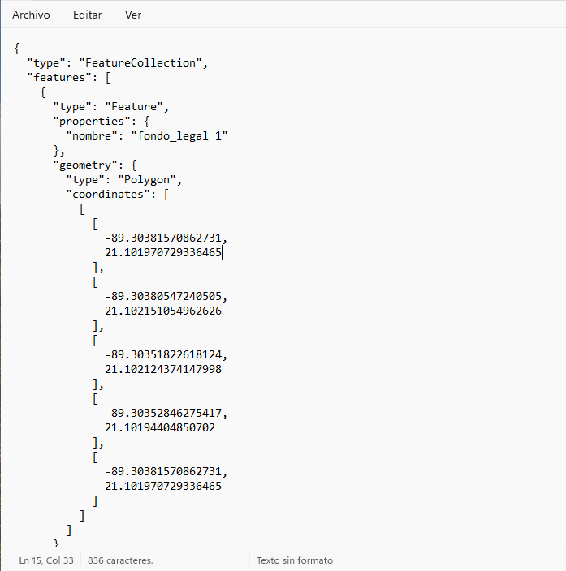

# Hunab-ku

 🗺️ Geospatial desktop application for locating cadastral properties using UTM coordinates, bearings and distances.

Hunab-ku is a Python desktop application designed to help work with cadastral and geospatial information.

The application allows users to calculate locations from UTM coordinates, bearings and distances, visualize the resulting geometry and export the information to formats such as HTML and GeoJSON.

## License

Ver el archivo [LICENSE](LICENSE.md) para los derechos de licencia y limitaciones (AGPLv3).

## Requisitos

- **ttkbootstrap**: Para mejorar la apariencia de la interfaz gráfica.
- **folium**: Para la visualización de mapas interactivos.
- **shapely**: Para la manipulación y análisis de geometrías.
- **pyproj**: Para la conversión de coordenadas geográficas y UTM.

## Secciones

- **Carga de múltiples propiedades**: Funcionalidad para cargar varios inmuebles en un solo plano.
- **Geolocalización por coordenadas UTM**: Ubicación precisa de un predio usando coordenadas en el sistema UTM (Universal Transverse Mercator).
- **Geolocalización por rumbos y distancias**: Cálculo y ubicación de predios a partir de rumbos y distancias.

## Exportación

- **HTML**: Exporta el plano en formato HTML, precargado en un mapa interactivo.
- **GeoJSON**: Exporta el plano en formato GeoJSON, compatible con otros sistemas de información geográfica (SIG).

## Descripción

Hunab-ku es una herramienta diseñada para facilitar la creación y geolocalización de planos catastrales. Permite ingresar coordenadas UTM o usar rumbos y distancias para determinar la ubicación exacta de un predio. La aplicación exporta los resultados en formatos estándar como HTML y GeoJSON, lo que facilita su visualización y uso en sistemas SIG.

## Instalación

1. Clona este repositorio:

    ```bash
   git clone https://github.com/crowslayer/hunab-ku.git

2. Navega al directorio del proyecto:

    ```bash
   cd hunab-ku
   
3. Crea un entorno virtual (opcional, pero recomendado):

    ```bash
   python -m venv .venv
   
4. Activa el entorno virtual:
    - En Windows:
        ```bash
        .venv\Scripts\activate
    - En masOS

        ```bash
        source .venv\bin\activate

5. Instala las dependencias:

    ```bash
   pip install -r requirements.txt

6. Ejecuta la aplicación:

    ```bash
   python main.py

## Uso
- **Cargar un plano:** Utiliza la interfaz gráfica para cargar un plano catastral en formato UTM o con rumbos y distancias.
- **Geolocalizar:** Después de cargar el plano, selecciona las coordenadas UTM o ingresa los valores de rumbos y distancias para ubicar el predio en el mapa.
- **Exportar:** Una vez que el plano esté listo, elige el formato (HTML o GeoJSON) para exportar.

## Contribuciones
¡Las contribuciones son bienvenidas! Si deseas mejorar el proyecto, abre un pull request o un issue con tus sugerencias.

## Contacto
**Autor:** Alex Herrera  
**Licencia:** AGPLv3  
**Email**: crowslayer@gmail.com

## Donaciones

Si deseas apoyar este proyecto:

****
<a href="https://www.paypal.com/donate/?hosted_button_id=3VLCPQZWUGACS"></a>

¡Gracias por contribuir! 

## Imagenes







